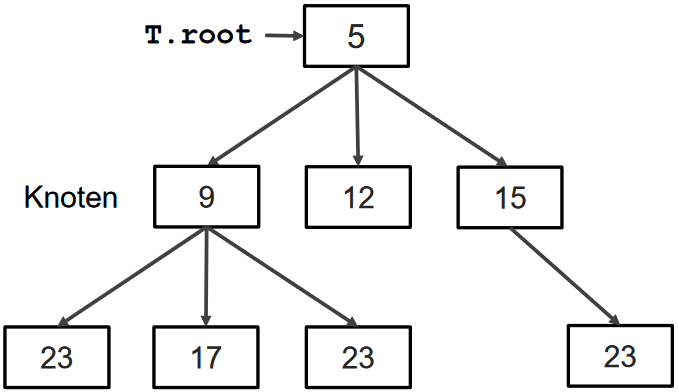
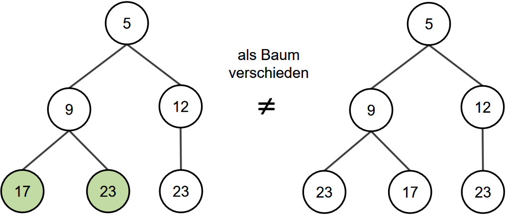
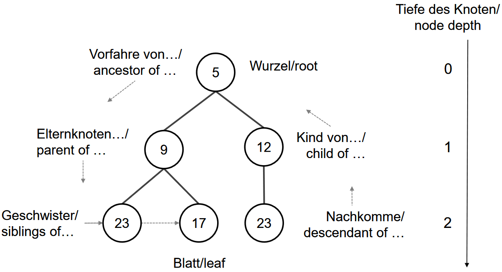

<!--
Render with
"pandoc klausur.md -o klausur.pdf -V geometry:a4paper -V geometry:margin=1cm -V geometry:includeheadfoot=true -s --template eisvogel --listings -N --filter pandoc-latex-environment"

pandoc-latex-environment needs to be installed and also TexLive or MikTex
if not installed the latex package "awesomebox" needs to be installed
-->

# Basisbegriffe

## Bestimmt

- Determiniertheit: Algorithmus liefert bei gleicher Eingabe gleiche Ausgabe
- Determinismus: Algorithmus durchläuft für gleiche Eingabe immer die gleichen Schritte/Zustände

## Anwendbar

- Allgemeinheit: Algorithmus für ganze Problemklasse anwendbar
- Korrektheit: Falls Algorithmus terminiert, ist die Ausgabe richtig

## Berechenbar

- Terminierung: Algorithmus stoppt in endlicher Zeit
- Finitheit: Algorithmus hat endliche Beschreibung
- Effektivität: Schritte sind auf einer Maschine ausführbar

## Datenstruktur

Eine Datenstruktur ist eine Methode, Daten für den Zugriff und die Modifikation zu organisieren

## Algorithmus

Eine aus endlich vielen Schritten bestehende,
ausführbare Handlungsvorschrift zur eindeutigen Umwandlung von Eingabe- in Ausgabedaten

## Abstrakter Datentyp ("was")

näher an der Anwendung

Beispiel:

Stack mit Operationen `isEmpty, pop, push`

## Datenstruktur ("wie")

näher an der Maschine

Beispiel:

Stack-Operationen als Array oder verkette Liste

\pagebreak

# Sortieralgorithmen

## Insertion Sort

- aufsteigend

  ```pseudo
  insertionSort(A)
      FOR i=1 TO A.length-1 DO
          // insert A[i] in pre-sorted sequence A[0..i-1]
          key=A[i];
          j=i-1; // search for insertion point backwards
          WHILE j>=0 AND A[j]>key DO
              A[j+1]=A[j]; // move elements to right
              j=j-1;
          A[j+1]=key;
  ```

- absteigend

  ```pseudo
  insertionSort(A)
      FOR i=1 TO A.length-1 DO
          // insert A[i] in pre-sorted sequence A[0..i-1]
          key=A[i];
          j=i-1; // search for insertion point backwards
          WHILE j>=0 AND A[j]<key DO
              A[j+1]=A[j]; // move elements to right
              j=j-1;
          A[j+1]=key;
  ```

## Bubblesort

```pseudo
bubbleSort(A)
    FOR i = A.length - 1 DOWNTO 0 DO
        FOR j = 0 TO i - 1 DO
            IF A[j] > A[j+1] THEN SWAP(A[j], A[j+1]);
                //temp=A[j+1]; A[j+1]=A[j]; A[j]=temp;
```

unsortiert: [2,4,1,3]

sortiert: [1,2,3,4]

## Stone Sort

```pseudo
stoneSort(A)
    FOR i = A.length - 1 DOWNTO 0 DO
        FOR j = A.length - 1 TO A.length - 1 DO
            IF A[j] < A[j-1] THEN SWAP(A[j], A[j-1]);
                //temp=A[j-1]; A[j-1]=A[j]; A[j]=temp;
```

unsortiert: [2,4,1,3]

sortiert: [4,3,2,1]

## Merge Sort

```pseudo
mergeSort(A,l,r) // initial call: l=0,r=A.length-1
    IF l<r THEN //more than one element
        m=floor((l+r)/2); // m (rounded down) middle (last index left part)
        mergeSort(A,l,m); // sort left part
        mergeSort(A,m+1,r); // sort right part
        merge(A,l,m,r); // merge into one
```

::: tip
Idee:

Liste in Hälften teilen, diese rekursiv sortieren und wieder zusammen sortieren.
:::

```pseudo
merge(A,l,m,r) // requires l<=m<=r
    //array B with r-l+1 elements as temporary storage
    pl=l; pr=m+1; // position left, right
    FOR i=0 TO r-l DO // merge all elements
        IF pr>r OR (pl=<m AND A[pl]=<A[pr]) THEN
            B[i]=A[pl];
            pl=pl+1;
        ELSE //next element at pr
            B[i]=A[pr];
            pr=pr+1;
    FOR i=0 TO r-l DO
        A[i+l]=B[i]; //copy back to A
```

::: tip
Idee:

Nächstes Element kleinstes Element aus linker oder rechter Teilliste und dann in dieser Liste eine Position nach vorne gehen.

Jede Teilliste wird genau einmal durchlaufen $\Rightarrow$ Laufzeit von `merge` $= \Theta(n_L+n_R)$
:::

## Quicksort

```pseudo
quicksort(A,l,r) // initial call: l=0,r=A.length-1
    IF l<r THEN //more than one element
        p=partition(A,l,r); // p partition index
        quicksort(A,l,p); // sort left part
        quicksort(A,p+1,r); // sort right part
```

::: tip
Idee:

Divide & Conquer wie bei Merge Sort.

Liste partitionieren, dann Teillisten rekursiv sortieren.
:::

```pseudo
partition(A,l,r) //requires l<r, returns int in l..r-1
    pivot=A[l];
    pl=l-1; pr=r+1; //move from left resp. right
    WHILE pl<pr DO
        REPEAT pl=pl+1 UNTIL A[pl]>=pivot; //move left up
        REPEAT pr=pr-1 UNTIL A[pr]=<pivot; //move right down
        IF pl<pr THEN
            Swap(A[pl],A[pr]);
        p=pr; //store current value
    return p // A[l..p] left, A[p+1..r] right
```

::: tip
Idee:

Ein Element (z.B. erstes) als Pivot wählen und Elemente partitionieren, sodass $Elemente \leq Pivot$ in der linken Teilliste sind und $Elemente \geq Pivot$ in der rechten Teilliste

Laufzeit von `partition` $\Theta(n)$
:::

::: note
Randomisirte Variante von Quicksort:

Wählt als Pivot Element immer zufällig eines der Elemente und tauscht es an den Anfang der Liste, damit der gleiche Algorithmus verwendet werden kann.
:::

## Radix Sort

```pseudo
radixSort(A) // keys: d digits in range [0,D-1]
// B[0][],…, B[D-1][] buckets (init: B[k].size=0)
    FOR i=0 TO d-1 DO //0 least, d-1 most sign. digit
        FOR j=0 TO n-1 DO
            putBucket(A,B,i,j);
        a=0;
        FOR k=0 TO D-1 DO //rewrite to array
            FOR b=0 TO B[k].size-1 DO
                A[a]=B[k][b]; //read out bucket in order
                a=a+1;
            B[k].size=0; //clear bucket again
    return A
```

```pseudo
putBucket(A,B,i,j) // call-by-reference
    z=A[j].digit[i]; // i-th digit of A[j]
    b=B[z].size; // next free spot
    B[z][b]=A[j];
    B[z].size=B[z].size+1;
```

::: tip
Gesamt Idee:

Schlüssel sind d-stellige Werte in D-närem Zahlensystem

Werte werden in "Buckets" aufgeteilt. "Buckets" erlauben einfügen und entnehmen (in eingefügter Reihenfolge) in konstanter Zeit. Daher als Queue zu realisieren

- $i$-te Iteration ($i \in [0 \dots d-1]$):
  1. Zahlen nach $i$-ter Ziffer sortieren in entsprechenden Bucket
  2. Aufsteigend die Buckets durchgehen und an nächster Stelle in Array ablegen
- funktioniert nur wenn mit niedrigswertigen Ziffer begonnen wird
:::

## Laufzeiten

+---------------------------------------+-----------------------------+-------------------------------------------+--------------------------------------------------+
| Inserion Sort                         | Merge Sort                  | Quicksort                                 | Radix Sort                                       |
+=======================================+=============================+===========================================+==================================================+
| Laufzeit $\Theta(n^2)$                | Beste asymptotische         | Worst-Case-Laufzeit $\Theta(n^2)$\        | Zifferbereichgröße D als konstant ansehen:       |
|                                       |                             |                                           | Laufzeit $O(d \cdot n)$\                         |
|                                       | Laufzeit $\Theta(n\log(n))$ | randomisirt mit erwarteter                | Wenn auch $d$ als konstant angehesen:            |
|                                       |                             |                                           | Laufzeit $O(n)$\                                 |
|                                       |                             | Laufzeit $\Theta(n \cdot log(n))$         | **Aber:** eindeutige Schlüssel für $n$           |
|                                       |                             |                                           | Elemente benötigen d = $\Theta(\log_D(n)$ Ziffen |
|                                       |                             |                                           | $\Rightarrow$ Laufzeit $O(n \cdot \log(n))$      |
+---------------------------------------+-----------------------------+-------------------------------------------+--------------------------------------------------+
| einfache Implementierung              |                             | in Praxis meist schneller als Merge Sort, |                                                  |
|                                       |                             | da weniger Kopieroperationen              |                                                  |
+---------------------------------------+-----------------------------+-------------------------------------------+--------------------------------------------------+
| für kleine $n \leq 50$ oft beste Wahl |                             | Implementierungen schalten für kleine $n$ |                                                  |
|                                       |                             | meist auf Insertion Sort                  |                                                  |
+---------------------------------------+-----------------------------+-------------------------------------------+--------------------------------------------------+

::: note
Untere Schranke für vergleichsbasierte Sortieralgorithmen:

$\Omega(n \cdot \log(n)) \Rightarrow$ jeder vergleichsbasierter Algorithmus muss mindestens $n \cdot \log(n)$ Schritte machen.
:::

\pagebreak

# Konzepte

## Divide & Conquer (& Combine)

Problem in Teilprobleme zerlegen und Teilprobleme rekursiv lösen.

### Beispiele

- Mergesort
  - Liste in Hälften Teilen, rekursiv sortieren, wieder zusammen sortieren
- Quicksort

# Landau Symbole / asymptotische Komplexität

## O-Notation

$$
O(g) = \{f: \exists c \in \mathbb{R}_{>0},n_0 \in \mathbb{N},\forall n \geq n_0, 0 \leq f(n) \leq c g(n) \}
$$

$f$ wächst höchstens so schnell wie $g$

::: note
$O(n) \subseteq O(n^2) \subseteq O(n^3) \subseteq O(n^4) \subseteq O(n^5) \subseteq \dots$
:::

## O-Notation Rechenregeln

Konstanten: $f(n)=a$ mit $a \in \mathbb{R}_{>0}$ konstant. Dann $f(n)=O(1)$

Skalare Multiplikation: $f=O(g)$ und $a \in \mathbb{R}_{>0}$. Dann $a \cdot f = O(g)$

Addition: $f_1=O(g_1)$ und $f_2=O(g_2)$. Dann $f_1+f_2=O(max\{g_1,g_2\})$ ($max$ punktweise)

Multiplikation: $f_1=O(g_1)$ und $f_2=O(g_2)$. Dann $f_1 \cdot f_2=O(g_1 \cdot g_2)$

## $\Omega$-Notation

$$\Omega(g) = \{f: \exists c \in \mathbb{R}_{>0},n_0 \in \mathbb{N},\forall n \geq n_0, 0 \leq c g(n) \leq f(n) \}$$

$f$ wächst mindestens so schnell wie $g$

::: note
$\Omega(n) \supseteq \Omega(n^2) \supseteq \Omega(n^3) \supseteq \Omega(n^4) \supseteq \Omega(n^5) \supseteq \dots$
:::

## Zusammenhang O, $\Omega$ und $\Theta$

Für beliebige $f(n) , g(n): \mathbb{N} \mathbb{R} \rightarrow \mathbb{R}_{>0}$ gilt:

$f(n) = \Theta(g(n))$ genau dann,wenn $f(n) = O(gn(n))$ und $f(n) = \Omega(g(n))$

::: important
**Hinweis**

$f = O(g)$ übliche Schreibweise, sollte als $f \in O(g)$ gelesen werden

Ungleichungen mit $\leq$ nur mir O

Ungleichungen mit $\geq$ nur mit $\Omega$

Wenn $=$, dann $\Theta$
:::

## Komplexitätklassen

| Klasse                    | Bezeichnung   | Beispiel               |
| ------------------------- | ------------- | ---------------------- |
| $\Theta(1)$               | Konstant      | Einzeloperation        |
| $\Theta(\log(n))$         | Logarithmisch | Binäre Suche           |
| $\Theta(n)$               | Linear        | Squentielle Suche      |
| $\Theta(n \cdot \log(n))$ | Quasilinear   | Sortieren eines Arrays |
| $\Theta(n^2)$             | Quadratisch   | Matrixaddition         |
| $\Theta(n^3)$             | Kubisch       | Matrixmultiplikation   |
| $\Theta(n^k)$             | Polynomell    |                        |
| $\Theta(2^n)$             | Expotentiell  | Travelling-Salesmen    |
| $\Theta(n!)$              | Faktoriell    | Permutation            |

# Rekursionsgleichungen/Laufzeitanalyse

(am Beispiel Merge Sort)

Sei $T(n)$ die maximale Anzahl von Schritten für Arrays der Größe $n$ (für $n \geq 2$):

$$
T(n) \leq 2 \cdot T(n/2) + c + d \cdot n
$$

$2 \cdot T(n/2)$: 2 rekursive Aufrufe für jeweils halb so großes Array

$c$: IF + floor (konstanter Aufwand)

$d \cdot n$:Merge (Aufwand $O(n)$)

$T(1) \leq c$ da l=r

::: tip
Es gilt auch $T(n) \geq \Omega(n \cdot \log(n))$

Somit ist die Laufzeit von Merge Sort $\Theta(n \cdot \log(n))$
:::

## Manuelle Iteration

$$
T(n) \leq 2 \cdot T(n/2) + c \cdot n
$$
$$
T(n) \leq 2 \cdot (2 \cdot T(n/4) + (c\cdot n)/2) + c \cdot n
$$
$$
\vdots
$$
$$
T(n) \leq 2 \cdot (2 \cdot (2 \cdots (2 \cdot T(1) + 2) \cdots + (c\cdot n)/4) + (c\cdot n)/2) + c \cdot n
$$
$$
T(n) \leq 2 \cdot (2 \cdot (2 \cdots (2 \cdot c + 2) \cdots + (c\cdot n)/4) + (c\cdot n)/2) + c \cdot n
$$
$2 \cdot (2 \cdot (2 \cdots (2 \cdot \rightarrow$ $\log_2(n)$-mal
$$
T(n) \leq 2^{\log_2(n)} \cdot c + \log_2(n) \cdot c \cdot n = O(n \cdot \log(n))
$$

## Mastertheorem

Allgemeine Form der Rekursionsgleichung:

$$
T(n) = a \cdot T(n/b) + f(n), \qquad T(1) = \Theta(1)
$$

mit $a \geq 1, b > 1$ und $f(n)$ eine asymptotische Funktion

### Definition

Seien $a \geq 1$ und $b > 1$ Konstanten. Sei $f(n)$ eine positive Funktion und $T(n)$ über den nicht-negativen ganzen Zahlen durch die Rekursionsgleichung
$$
T(n) = a \cdot T(n/b) + f(n), \qquad T(1) = \Theta(1)
$$

definiert, wobei wir $n/b$ so interpretieren, dass damit entweder $\lfloor n/b \rfloor$ oder $\lceil n/b \rceil$ gemeint ist. Dann besitzt $T(n)$ die folgenden asymptotischen Schranken:

1. Gilt $f(n) = O(n^{\log_b(a)-\epsilon})$ für eine Konstante $\epsilon > 0$, dann $T(n) = \Theta(n^{\log_b(a)})$
2. Gilt $f(n) = \Theta(n^{\log_b(a)})$, dann gilt $T(n) = \Theta(n^{\log_b(a)} \cdot \log_2(n))$
3. Gilt $f(n) = \Omega(n^{\log_b(a)+\epsilon})$ für eine Konstante $\epsilon > 0$ und $a \cdot f(n/b) \leq c \cdot f(n)$ für eine Konstante $c < 1$ und hinreichend große $n$, dann ist $T(n) = \Theta(f(n))$

::: note
Entscheidend ist das Verhältnis von $f(n)$ zu $n^{\log_b(a)}$

1. Wenn $f(n)$ polynomiell kleiner als $n^{\log_b(a)}$, dann $T(n) = \Theta(n^{\log_b(a)})$
2. Wenn $f(n)$ und $n^{log_b(a)}$ gleiche Größenordnung, dann $T(n) = \Theta(n^{\log_b(a)}\cdot \log(n))$
3. Wenn $f(n)$ polynomiell größer als $n^{log_b(a)}$ und $a \cdot f(n/b) \leq c \cdot f(n)$, dann $T(n) = \Theta(f(n))$

Bei 1. & 3. unterscheidet sich der polynomielle Faktgor $n^\epsilon$
:::

### Beispiele

1. Merge Sort:

   $$
   T(n) = 2 \cdot T(n/2) + c \cdot n
   $$

   Fall 2, da $a = b = 2; \log_b(a)=1; f(n) = \Theta(n)=\Theta(n^{\log_b(a)})$

   $$
   T(n) = \Theta(n^{\log_b(a)}\cdot \log_2(n))=\Theta(n \cdot \log_2(n))
   $$

2. $T(n) = 4 \cdot T(n/3) + c \cdot n$

   Fall 1, da $a=4; b= 3; \log_b(a) = 1.26 \dots; \epsilon = 0.26\dots; f(n) = \Theta(n)=\Theta(n^{\log_b(a)-\epsilon})$

   $T(n)=\Theta(n^{\log_b(a)})=\Theta(n^{1.26 \dots})$

3. $T(n) = 3 \cdot T(n/3) + c \cdot n^2$

   Fall 3, da $a=b=3; \log_b(a)=1; \epsilon = 1; f(n) = \Theta(n^2)=\Theta(n^{\log_b(a)+\epsilon}); 3 \cdot f(n) = (c \cdot n^2)/3 \leq \frac{1}{3} \cdot f(n)$

   $T(n)=\Theta(f(n))=\Theta(n^2)$

4. $T(n) = 25 \cdot T(n/5) + n^4 \cdot \log_3(n) +15$

   Fall 3, da $a=25; b= 5; \log_b(a)=2; \epsilon = 1; f(n) = n^4 \cdot \log_3(n) + 15 = \Omega(n^{2+\epsilon}) = \Omega(n^3); 25 \cdot f(n/5) = 25 \cdot \frac{n^4}{5^4} \cdot \log_3(\frac{n}{5})+15 \leq \frac{1}{25} \cdot f(n)$

   $T(n) = \Theta(f(n)) = \Theta(n^4 \cdot \log(n))$

5. $T(n) = 4 \cdot T(n/5) + n^2 \cdot \log(n)$

   Fall 3, da $a=b=4; \log_b(a)=1; \epsilon = 0.1; f(n) = n^2 \cdot \log(n)=\Omega(n^2) \subseteq \Omega(n^{1+\epsilon}); 4 \cdot f(n) = \frac{n^2}{4} \cdot \log(\frac{n}{4}) \leq \frac{1}{4} \cdot f(n)$

   $T(n)=\Theta(f(n))=\Theta(n^2 \cdot \log(n))$

6. $T(n) = 8 \cdot T(n/2) + n^3 \cdot \log_4(n+16)$

   Kein Fall anwendbar, da $a = 8; b = 2; \log_b(a)=3; f(n) = n^3 \cdot \log_4(n+16)$ für jedes $\epsilon > 0$ gilt $f(n) \neq O(n^{\log_b(a) - \epsilon})$, $f(n) \neq \Omega(n^{\log_b(a) + \epsilon})$ und $f(n) \neq \Theta(n^{\log_b(a)})$

\pagebreak

# Basic Data Structure

## Stacks

### Abstrakter Datentyp

| Befehl       | Beschreibung                                                                                       |
| ------------ | -------------------------------------------------------------------------------------------------- |
| `new(S)`     | erzeugt neuen (leeren) Stack namens `S`                                                            |
| `isEmpty(S)` | gibt an ob der Stack `S` leer ist                                                                  |
| `pop(S)`     | gibt oberstes Element vom Stack `S` zurück und löscht es vom Stack (Fehlermeldung wenn Stack leer) |
| `push(S, k)` | schreibt `k` als neues oberstes Element auf Stack `S` (Fehlermeldung wenn Stack voll)              |

LIFO - last in, last out

Beispiele:

- Bitcoins nutzen Stacks um verschiedene Werte während dem Verifikationsprozess zu speichern

### Implementierung: Array

```pseudo
new(S)
    S.A[]=ALLOCATE(MAX);
    S.top=-1;
```

```pseudo
isEmpty(S)
    IF S.top<0 THEN
        return true
    ELSE
        return false;
```

```pseudo
pop(S)
    IF isEmpty(S) THEN
       error "underflow"
    ELSE
        S.top=S.top-1;
        return S.A[S.top+1];
```

```pseudo
push(S,k)
    IF S.top==MAX-1 THEN
      error "overflow"
    ELSE
        S.top=S.top+1;
        S.A[S.top]=k;
```

::: note
Stacks mit variabler Größe

Entweder in neues größeres Array umkopieren oder auf viele Arrays verteilen ($\rightarrow$ verkette Listen)
:::

::: warning
Problem ist durchschnittlich $\Omega(n)$ Kopierschritte pro `push`.

Reduzierung durch verdoppelung des Arrays, wenn an Grenze und schrumpfen, wenn weniger als Viertel belegt.

Siehe [variables Array](#implementierung-variables-array).
:::

### Implementierung: variables Array

```pseudo
new(S)
    S.A[]=ALLOCATE(1);
    S.top=-1;
    S.memsize=1;
```

```pseudo
isEmpty(S)
    IF S.top<0 THEN
        return true
    ELSE
        return false;
```

```pseudo
pop(S)
    IF isEmpty(S) THEN
        error "underflow"
    ELSE
        S.top=S.top-1;
        IF 4*(S.top+1)==S.memsize THEN
            S.memsize=S.memsize/2;
            RESIZE(S.A,S.memsize);
        return S.A[S.top+1];
```

```pseudo
push(S,k)
    S.top=S.top+1;
    S.A[S.top]=k;
    IF S.top+1==S.memsize THEN
        S.memsize=2*S.memsize;
        RESIZE(S.A,S.memsize);
```

::: note
Im Durchschnitt für jeden der mindestens $n$ Befehle $\Theta(1)$ Umkopierschritte!
:::

## Verkettete Liste

- head zeigt auf erstes Element, bzw. ist `nil` für leere Liste

Jedes Element `x` besteht aus:

- key (Wert)
- prev (Zeiger auf Vorgänger, bzw. `nil`)
- next (Zeiger auf Nachfolger, bzw. `nil`)

### Als Array

|       |          |          |            |         |          |          |          |            |          |
| ----- | -------- | -------- | ---------- | ------- | -------- | -------- | -------- | ---------- | -------- |
| Werte | 12 (key) | 6 (prev) | nil (next) | - (key) | - (prev) | - (next) | 45 (key) | nil (prev) | 0 (next) |
| Index | 0        | 1        | 2          | 3       | 4        | 5        | 6        | 7          | 8        |

entspricht doppelt verketter Liste $45 \leftrightarrow 12$

### Elementare Operationen

```pseudo
search(L,k) //returns pointer to k in L (or nil)
    current=L.head;
    WHILE current != nil AND current.key != k DO
        current=current.next;
    return current;
```

::: note
Laufzeit für `search` $\Theta(n)$
:::

```pseudo
insert(L,x) //inserts element x in L
    x.next=L.head;
    x.prev=nil;
    IF L.head != nil THEN
        L.head.prev=x;
    L.head=x;
```

::: note
Laufzeit für `insert` $\Theta(1)$

Wenn auch überprüft wird ob Wert bereits in Liste, dann Laufzeit $\Omega(n)$!
:::

```pseudo
delete(L,x) //deletes element x from L
    IF x.prev != nil THEN
        x.prev.next=x.next
    ELSE
        L.head=x.next;
    IF x.next != nil THEN
        x.next.prev=x.prev;
```

::: note
Laufzeit für `delete` $\Theta(1)$
:::

### Sentinel

Um Randfälle beim Löschen für Listenanfang/-ende zu eliminieren, wird Listenanfang durch Sentinel ersetzt.

Eigenschaften:

- von außen nicht sichtbar
- Wert `nil`
- Leere Liste besteht nur aus Sentinel
- `head` zeigt auf `L.sent.next`

Löschen mit Sentinel:

```pseudo
deleteSent(L,x) // deletes x from L with sentinel
    x.prev.next=x.next;
    x.next.prev=x.prev;
```

::: note
Andere Operationen wie Einfügen müssen auch angepasst werden
:::

## Queue

### Befehle

| Befehl          | Beschreibung                                                                                             |
| --------------- | -------------------------------------------------------------------------------------------------------- |
| `new(Q)`        | erzeugt neue (leere) Queue namens `Q`                                                                    |
| `isEmpty(Q)`    | gibt an ob die Queue `Q` leer ist                                                                        |
| `dequeue(Q)`    | gibt vorderstes Element der Queue `Q` zurück und löscht es aus der Queue (Fehlermeldung wenn Queue leer) |
| `enqueue(Q, k)` | schreibt `k` als neues hinterstes Element in Queue `Q` (Fehlermeldung wenn Queue voll)                   |

FIFO - first in, first out

### Queues als zyklisches Array

::: tip
Wenn Array nicht zyklisch wäre, könnte Array Grenze erreicht werden oder Speicher wird verschwendet/ist nicht merh vorhanden
:::

::: note
Um bei einem zyklischen Array korrekt überprüfen zu können ob es leer ist wird Variable `empty` eingeführt.
Alertantiv ein Element als Platzhalter reservieren.

`Q` leer, ween `front == rear` und `empty == true`

`Q` voll, wenn `front == rear` und `empty == false`
:::

```pseudo
new(Q)
    Q.A[]=ALLOCATE(MAX);
    Q.front=0;
    Q.rear=0;
    Q.empty=true;
```

```pseudo
isEmpty(Q)
    return Q.empty;
```

```pseudo
dequeue(Q)
    IF isEmpty(Q) THEN
        error "underflow"
    ELSE
        Q.front=Q.front+1 mod MAX;
        IF Q.front==Q.rear THEN
            Q.empty=true;
        return Q.A[Q.front-1 mod MAX];
```

```pseudo
enqueue(Q,k)
    IF Q.rear==Q.front AND !Q.empty THEN
        error "overflow"
    ELSE
        Q.A[Q.rear]=k;
        Q.rear=Q.rear+1 mod MAX;
        Q.empty=false;
```

::: tip
Zyklisches Array als Kreis vorstellen

{width=70%}
:::

### Queue als einfach verkettete Liste

::: big
$\underset{\underset{front}{\uparrow}}{5} \rightarrow 12 \rightarrow 17 \rightarrow \underset{\underset{rear}{\uparrow}}{47}$
:::

$front$ wandert beim auswerfen nach rechts

$rear$ wandert beim einfügen nach rechts

```pseudo
new(Q)
    Q.front=nil;
    Q.rear=nil;
```

```pseudo
isEmpty(Q)
    IF Q.front==nil THEN
        return true
    ELSE
        return false;
```

```pseudo
dequeue(Q)
    IF isEmpty(Q) THEN
        error "underflow"
    ELSE
        x=Q.front;
        Q.front=Q.front.next;
        return x;
```

```pseudo
enqueue(Q,x)
    IF isEmpty(Q) THEN
        Q.front=x;
    ELSE
        Q.rear.next=x;
    x.next=nil;
    Q.rear=x;
```

## Anzahl der Operation im Worst-Case

Stack

| Operation | Laufzeit    |
| --------- | ----------- |
| Push      | $\Theta(1)$ |
| Pop       | $\Theta(1)$ |

Queue

| Opertaion | Laufzeit    |
| --------- | ----------- |
| Enqueue   | $\Theta(1)$ |
| Dequeue   | $\Theta(1)$ |

Verkettete Liste

| Operation | Laufzeit                               |
| --------- | -------------------------------------- |
| Einfügen  | $\Theta(1)$                            |
| Löschen   | $\Theta(1)$ für einen Wert $\Omega(n)$ |
| Suchen    | $\Theta(n)$                            |

## Binäre Bäume

### Als verkettete Listen

Jeder Knoten enthält:

- `key`: Wert
- `child[]`: Array von Zeigern auf Kinder
- `parent`: Zeiger auf den Elternknoten

{width=70%}

::: note
Baum Bedingung:

Baum ist leer oder es gibt einen Knoten `r` ("Wurzel"), so dass jeder Knoten `v` von der WUrzel aus per eindeutiger Sequenz von `child`-Zeigern erreichbar ist:

`v = r.chjild[i1].child[i2]. ... .child[im]`
:::

### Eigenschaften

- Bäume sind azyklisch
- Für nicht-leeren Baum gibt es genau $\#Knoten - 1$ viele Einträge $\neq nil$ über alle Listen `child[]`
- Höhe des Baumes = maximale Tiefe eines Knoten

::: tip
Bäume werden üblicherweise als ungerichtete Graphen dargestellt

{width=70%}
:::

::: tip
Begrifflichkeiten bei Bäumen:

{width=70%}

- Halbblätter haben genau ein Kinde
- Höhe eines nicht-leeren Baumes = max {Höhe aller Teilbäume der Wurzel} + 1
- Binärbäume: jeder Knoten hat maximal 2 Kinder (Ausgangsgrad $\leq 2$)
- Höhe leerer Baum per Konvention -1
:::

### Inorder

```pseudo
inorder(x)
    IF x != nil THEN
        inorder(x.left);
        print x.key;
        inorder(x.right);
```

::: note
Bei Zahlen diese einfach aufsteigend notieren, wenn Binärer Suchbaum.

Beispiel für Begrifflichkeiten Baum: 23, 9, 17, 5, 23, 12
:::

::: warning
Verschiedene Bäume können die gleiche Inorder haben.
:::

::: tip
Laufzeit bei Binärbäumen der Inorder-Traversierung: $O(n)$
:::

### Preorder

```pseudo
preorder(x)
    IF x != nil THEN
        print x.key;
        preorder(x.left);
        preorder(x.right);
```

::: note
Beispiel für Begrifflichkeiten Baum: 5, 9, 23, 17, 12, 23

Einsatzmöglichkeiten:

- Syntaxbaum von funktionalen Programmiersprachen
- Für Kopieren von Bäumen:
  1. Betrachtet zunächst Knoten und legt Kopie an
  2. Geht dann rekursiv in Teilbäume und kopiert diese
:::

::: warning
Verschiedene Bäume können die gleiche Preorder haben.
:::

### Postorder

```pseudo
postorder(x)
    IF x != nil THEN
        postorder(x.left);
        postorder(x.right);
        print x.key;
```

::: note
Beispiel für Begrifflichkeiten Baum: 23, 17, 9, 23, 12, 5

Einsatzmöglichkeiten:

- Löschen von Knoten:
  1. Geht zunächst rekursiv in Teilbäume und löscht diese
  2. betrachtet Knoten erst danah und löscht den kompletten Knoten
  - Zeiger auf rechten Teilbaum noch vorhanden, wenn linker bereits gelöscht
:::

::: warning
Verschiedene Bäume können die gleiche Postorder haben.
:::

### Preoder + Inorder + eindeutige Werte $\Rightarrow$ Binärbaum

- Preorder identifiziert Wurzel
- Inorder indentifiziert Wert im rechten und linken Teilbaum
- Analog für Postorder

### Abstrakter Datentyp Baum

| Befehl         | Beschreibung                                                        |
| -------------- | ------------------------------------------------------------------- |
| `new(T)`       | erzeugt neuen Baum namens `T`                                       |
| `search(T, k)` | gibt Element `x` in Baum mit `T` mit `x.key==k` zurück (bzw. `nil`) |
| `insert(T,x)`  | fügt Element `x` in Baum `T` hinzu                                  |
| `delete(T,x)`  | löscht `x` aus Baum `T`                                             |

oft weitere Baum-Operationen wie Wurzel, Höhe, Traversieren, ...

### Suchen

```pseudo
search(x,k)
    IF x==nil THEN
        return nil;
    IF x.key==k THEN
        return x;
    y=search(x.left,k);
    IF y != nil THEN
        return y;
    return search(x.right,k);
```

::: note
Laufzeit von `search`: $\Theta(n)$

jeder Knoten wird maximal einmal besucht, im schlechtesten Fall aber auch jeder Knoten
:::

### Einfügen

```pseudo
insert(T,x) //x.parent==x.left==x.right==nil;
    IF T.root != nil THEN
        T.root.parent=x;
        x.left=T.root;
    T.root=x;
```

::: note
Laufzeit von `search`: $\Theta(1)$

**Achtung:** erzeugt linkslastigen Baum!
:::

### Löschen

```pseudo
delete(T,x) //assumes x in T
    y=T.root;
    WHILE y.right!=nil DO
        y=y.right;
    connect(T,y,y.left);
    IF x != y THEN
        y.left=x.left;
        IF x.left != nil THEN
            x.left.parent=y;
        y.right=x.right;
        IF x.right != nil THEN
            x.right.parent=y;
    connect(T,x,y);
```

Laufzeit: $\Theta(h)$ h = Höhe des Baumes

